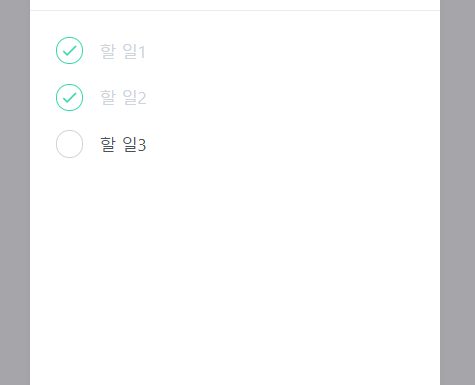

# TodoList 만들기

React로 만든 투두리스트입니다. 
스타일은 styled-components를 이용해 꾸몄습니다.

## 1. App.js

[코드보기](./src/App.js)

_styled-components의 createGlobalStyle_ 을 이용해 body색을 회색계열로 만들었습니다.
  

## 2. components/TodoTemplate.js

[코드보기](./src/components/TodoTemplate.js)

TodoList의 전체적인 틀을 만들어주는 컴포넌트입니다.

 

## 3. components/TodoHead.js

[코드보기](./src/components/TodoHead.js)

화면 위쪽에 오늘 날짜와 요일, 완료되지 않은 투두리스트의 갯수를 나타내주는 컴포넌트입니다.

  

## 4. components/TodoList.js

[코드보기](./src/components/TodoList.js)

모든 투두리스트를 나타내주는 컴포넌트입니다.
TodoContext.js에서 작성된 _useTodoState_ 를 통해 리스트의 상태를 불러와서 사용합니다.

각 리스트객체의 배열인 todos를 map함수를 이용해 리스트로 한 줄씩 만들어냅니다.

  

## 5. components/TodoItem.js

[코드보기](./src/components/TodoItem.js)

각 리스트 한 줄에 대한 스타일과
리스트항목 완료체크와 삭제 동작을 구현한 컴포넌트입니다.

체크버튼을 누르면 _dispatch_ 가 동작하여 done값이 토글되고, 토글상태에 따라서 체크표시와 글자색이 바뀝니다.
삭제버튼을 누르면 해당 리스트가 _dispatch_ 되고 filter함수를 통해 삭제됩니다.  

## 6. components/TodoCreate.js

[코드보기](./src/components/TodoCreate.js)

화면 가장 밑 중앙에 위치한 리스트추가버튼에 대한 컴포넌트입니다.

_useState_ 를 사용해 open이라는 상태를 관리하여
버튼을 눌렀을 때와 다시눌러 토글되었을 때마다 보여지는 화면이 다르게 나타납니다.
(한 번 눌렀을 때는 open값이 true가 되면서 입력창이 나타나고,
한 번 더 눌렀을 때는 open값이 false가 되면서 입력창이 사라집니다.)

입력창에 대한 입력값은 _useState_ 를 사용해 value라는 상태를 관리했습니다.
입력창에서 값이 submit되면 _dispatch_ 가 동작하여 id, text, done 값을 가지는 객체를 보내서 리스트에 추가하도록 구현했습니다.

  

## 7. components/TodoContext.js

[코드보기](./src/components/TodoContext.js)

투두리스트의 초기값과 Reducer를 만들어 _useReducer_ 에서 사용했습니다.

_createContext()_ 로 _Todo리스트의 상태(TodoStateContext)_ 와 _디스패치(TodoDispatchContext)_ 와 _다음리스트의 id값(TodoNextIdContext)에 대한 context_ 를 만들고, 
다른 컴포넌트에서 TodoState,TodoDispatch,TodoNextId Context를 빠르게쓰기위해
_useTodoState, useTodoDispatch, useTodoNextId_ 함수를 만들었습니다.

TodoProvider의 값을 어디서든 사용할 수 있도록 App.js에서 내용들의 가장 상위요소로 묶었습니다.  
